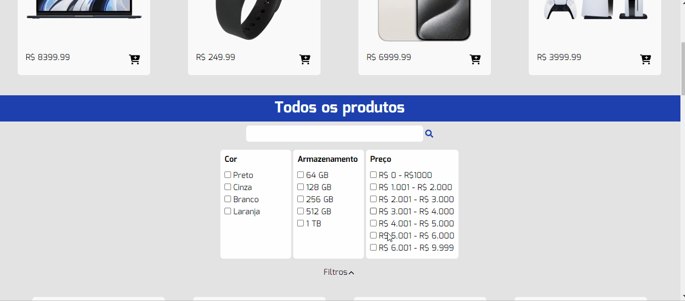
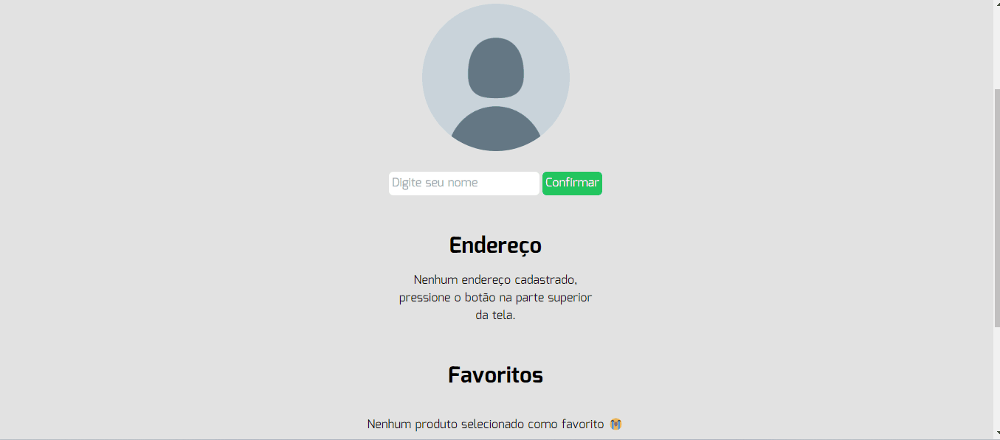

# e-commerce

## Descrição
    Esse é um projeto de um e-commerce usando React, TypeScript e Tailwind. single-page application (SPA).


## Funcionalidades
- Adiciona itens no carrinho.
- Filtra itens.
- Busca por informações do CEP informado.

## Tecnologias

- Tailwind: Estilizar com maior dinamismo.
- React Router: Usada para facilitar a navegação dentro da aplicação.
- ViaCEP: Usada para buscar CEP.
- Context API: Adicionando contexto para o carrinho e endereço.

## Gifs

### Navegação, filtragem, CEP, carrinho e favoritos





## Como utilizar

### clone do projeto
```
    git clone https://github.com/Ryanvrl/techshop.git

### Acessar a pasta
```
    cd "projeto"
```

### Instalação
```
    npm install
```

### Começar
```
    npm start
```
